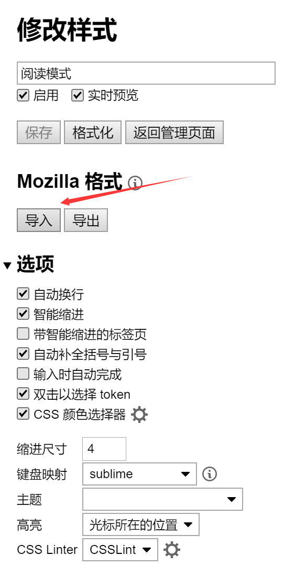
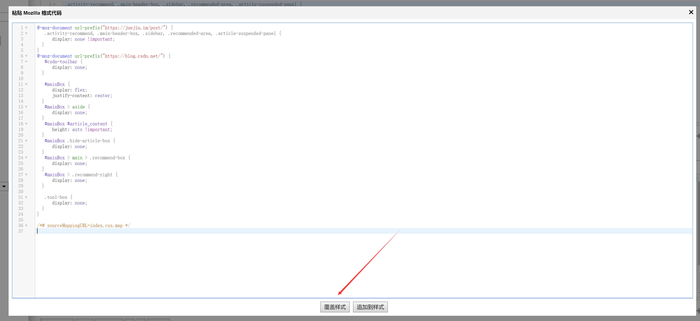

# style-reading-mode
样式库，实现各种网站的阅读模式。

# 用法
chrome用户安装[Stylus](https://chrome.google.com/webstore/detail/stylus/clngdbkpkpeebahjckkjfobafhncgmne)

创建一个用户样式，点击导入代码：

将[index.css](https://github.com/Yee2/style-reading-mode/blob/master/index.css)代码粘贴进去，点击`覆盖样式`,然后保存即可。

